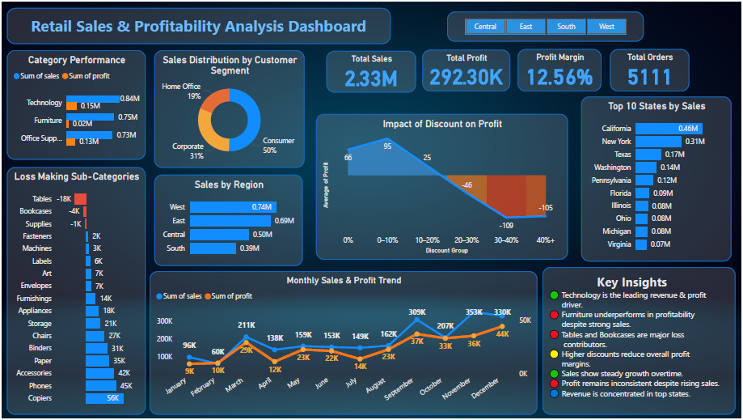

# 📊 Retail Sales & Profitability Analysis

## 🔍 Overview
This project analyzes retail sales data to evaluate business performance, identify profitability drivers, and generate actionable insights. The analysis was performed using SQL, Excel, and Power BI.

---

## 🎯 Objectives
- Analyze overall sales and profit performance  
- Identify high-performing and loss-making categories  
- Understand customer segment contribution  
- Evaluate regional sales distribution  
- Perform seasonal trend analysis  
- Analyze the impact of discounting on profitability  

---

## 🛠 Tools & Technologies
- SQL (MySQL)
- Microsoft Excel
- Power BI

---

## 📂 Dataset
The dataset includes retail transaction data with:
- Order Date and Customer Segment  
- Region and State  
- Category and Sub-Category  
- Sales, Profit, Quantity, and Discount  

---

## 📊 Key Analysis

### 1. KPI Analysis
- Total Sales, Profit, Profit Margin, and Orders  

### 2. Category & Sub-Category Analysis
- Identified high-performing and loss-making products  

### 3. Customer Segment Analysis
- Calculated percentage contribution of each segment  

### 4. Regional Analysis
- Analyzed sales distribution across states and regions  

### 5. Seasonal Trend Analysis
- Monthly and year-wise trend evaluation  
- Seasonal pattern identification  

### 6. Discount Impact Analysis
- Grouped discounts into ranges  
- Evaluated impact on average profit  

---

## 💡 Key Insights
- Technology is the most profitable category  
- Furniture shows high sales but low profitability  
- Consumer segment contributes ~50% of total sales  
- Sales are concentrated in key states like California and New York  
- Sales follow consistent seasonal trends  
- Higher discounts significantly reduce profitability  

---

## 📈 Dashboard

---

## 📄 Report
Detailed report available here:  
📎 [View Report](report/report.pdf)

---

## 🚀 How to Use
1. Download the dataset from the `data` folder  
2. Run SQL queries from the `sql` folder  
3. Open Power BI dashboard for visualization  

---

## 📌 Conclusion
This project highlights how data-driven analysis can uncover key business insights. It demonstrates the impact of product mix, customer behavior, and discount strategies on overall profitability.

---

## 🔗 Author
Aditya Pal  
LinkedIn: www.linkedin.com/in/aditya-pal-a5523b27b